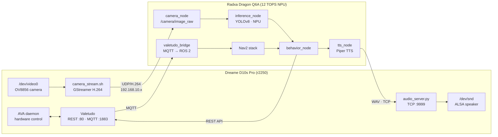

# I.P.P.O.L.I.T.
Intelligent Platform for Perception, Orientation, LLM Inference, and Tracking.

This robot is built on a reverse-engineered smart vacuum chassis, with the brush and dustbin removed to function purely  as a mobile AI platform.
Turning a Dreame robot vacuum into an AI platform — Valetudo integration, ROS 2 on companion board, computer vision, and custom navigation.

## Hardware

- **Robot**: Dreame D10s Pro (model r2250, AllWinner MR813 SoC, aarch64)
- **Companion board**: Radxa Dragon Q6A (Qualcomm QCS6490, 12 TOPS NPU, Adreno 643L GPU)
- **Firmware**: [Valetudo](https://valetudo.cloud) 2026.05.0 — cloud-free, local control

## Architecture



**Link:** Robot USB 2.0 → USB-Ethernet adapter → Dragon Q6A GbE (dedicated `192.168.10.0/24`)  
**Power:** Robot battery 14.8V → 12V buck converter → Dragon Q6A USB-C

## Repository structure

```
scripts/
  robot/
    _root.sh              early boot hook — WiFi bind-mount (deploy to /data/)
    _root_postboot.sh     late boot hook — DHCP, chroot mounts, Valetudo
    chroot.sh             enter Ubuntu 24.04 chroot on the robot
    camera_stream.sh      GStreamer pipeline: /dev/video0 → UDP H.264
    audio_server.py       TCP server: receives WAV from companion, plays via aplay
  companion/
    install_ros2.sh       install ROS 2 Jazzy on Dragon Q6A
robot/
  boot/README.md          deployment instructions for boot hooks
  valetudo/valetudo.json  Valetudo configuration
companion/
  ros2/                   ROS 2 node packages (valetudo_bridge, camera_node, …)
docs/
  hardware.md             wiring, power, physical mounting
  wifi-hack.md            why the bind-mount trick is needed for WiFi
```

## Quick start

See [docs/hardware.md](docs/hardware.md) for wiring and physical setup.  
See [robot/boot/README.md](robot/boot/README.md) for deploying boot hooks to the robot.  
See [scripts/companion/install_ros2.sh](scripts/companion/install_ros2.sh) for Dragon Q6A ROS 2 setup.
